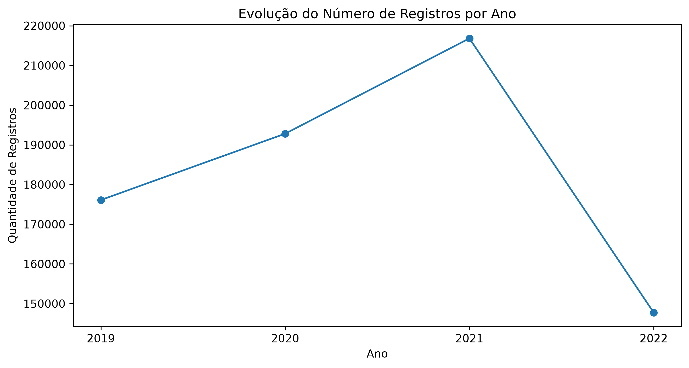
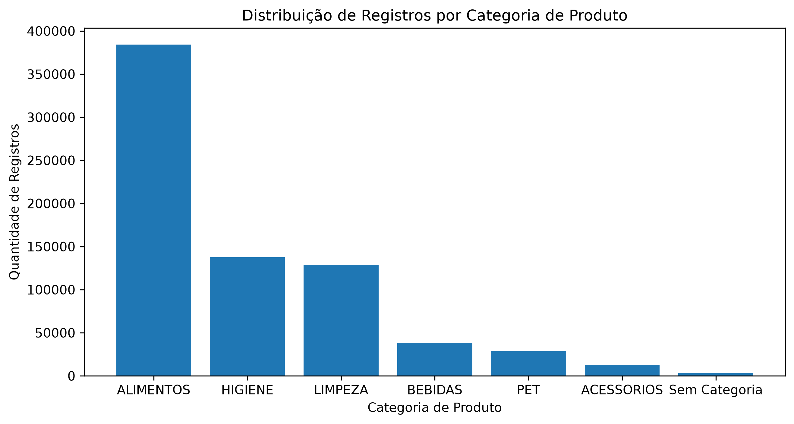
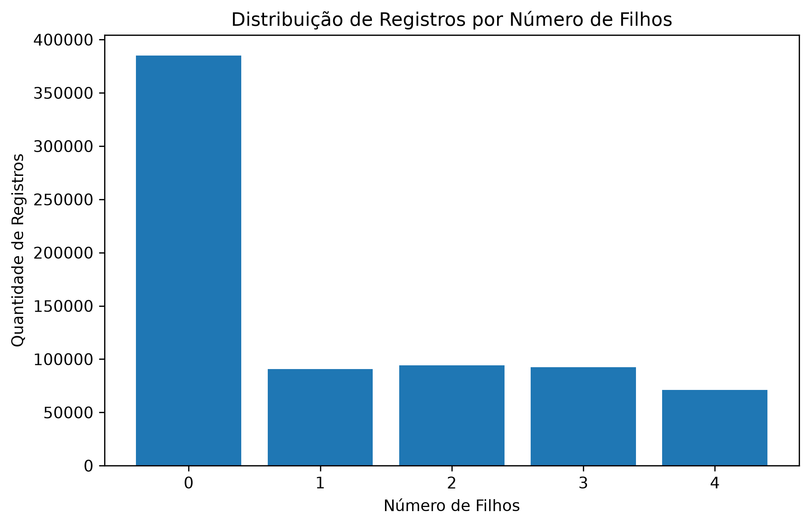
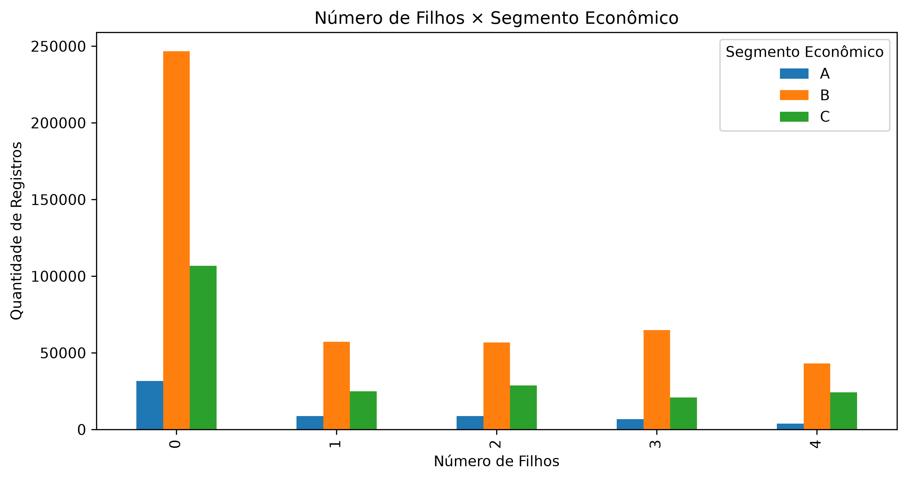

# 📊 Mini Projeto — Análise de Dados com Python | Módulo 1
**Felipe Busarello**   
**Curso:** Análise de Dados com Python  
**Turma:** 05 - 2026  
**Professor:** Cláudio Neves


## 📌 Sobre o Projeto

Este projeto foi desenvolvido como atividade avaliativa do **Módulo 1 do curso Análise de Dados com Python**.  
O objetivo é realizar uma **Análise Exploratória de Dados (AED)** sobre uma base de dados de varejo, aplicando conceitos de:  
- Extração e carregamento de dados;
- Verificação e validação;
- Limpeza e transformação;
- Estatística descritiva;
- Agrupamento de dados;
- Tabelas dinâmicas;
- Visualização;
- Interpretação dos resultados.  

O projeto utiliza Python, Pandas, NumPy, Matplotlib e o módulo `csv`.


## 🎯 Objetivos
O projeto tem como objetivos:  
- Carregar e validar uma base de dados CSV;
- Identificar problemas de qualidade dos dados;
- Tratar valores ausentes e inconsistências;
- Remover registros duplicados;
- Ajustar os tipos das variáveis;
- Realizar estatística descritiva;
- Identificar padrões de distribuição;
- Realizar agrupamentos com `groupby()` e `pivot_table()`;
- Criar visualizações para apoiar a interpretação dos dados;
- Registrar os principais insights obtidos durante a análise.


## 📊 Base de Dados
Foi utilizada a base **Base Varejo**, disponibilizada no Kaggle.  
**Fonte:** Kaggle  
**Dataset:** [Base Varejo](https://www.kaggle.com/datasets/namespaiva/base-varejo/data)  
A base contém informações relacionadas a compras realizadas por clientes de uma rede de supermercados.


### Principais campos
| Campo | Descrição |
|---|---|
| `DATA` | Data da compra |
| `CO_ID` | Identificação da compra |
| `CL_ID` | Identificação do cliente |
| `CL_GENERO` | Gênero informado pelo cliente |
| `CL_EC` | Estado civil do cliente |
| `CL_FHL` | Número de filhos |
| `CL_SEG` | Segmentação econômica |
| `PR_ID` | Código do produto |
| `PR_CAT` | Categoria do produto |
| `PR_NOME` | Nome do produto |


# 🔎 Processo de ETL
## 1. Extração
A base foi inicialmente carregada utilizando o `csv.DictReader`.  
Durante a primeira leitura foi identificado que o arquivo utilizava `;` como delimitador. O parâmetro `delimiter=";"` foi então utilizado para realizar a leitura corretamente.  
Posteriormente, a base também foi carregada utilizando `pandas.read_csv()`.


## 2. Transformação
Durante a preparação dos dados foram identificados e tratados os seguintes problemas:  

### Colunas sem informação  
Foram identificadas quatro colunas completamente vazias:  
- `Unnamed: 10`
- `Unnamed: 11`
- `Unnamed: 12`
- `Unnamed: 13`

Essas colunas foram removidas por não apresentarem informações úteis para a análise.

### Valores `#N/D`  
Foram identificados valores `#N/D` nas colunas:  
- `PR_CAT`
- `PR_NOME`

Os valores foram substituídos por:
| Coluna | Tratamento |
|---|---|
| `PR_CAT` | `Sem Categoria` |
| `PR_NOME` | `Sem Nome` |
  
Essa abordagem preservou os registros sem eliminar informações válidas das demais colunas.


### Tipos de dados  
Foram realizados os seguintes ajustes:  
- `CO_ID` >> `string`
- `CL_ID` >> `string`
- `PR_ID` >> `string`
- `DATA` >> `datetime`
  
A coluna `DATA` também foi validada após a conversão e não apresentou datas inválidas.  


### Registros duplicados  
Foram identificados: **96.553 registros duplicados.**  
Após a remoção das duplicidades: **733.447 registros.**  
A base final utilizada nas análises contém **733.447 registros**.


# 📈 Análise Exploratória
## 👨‍👩‍👧 Distribuição do número de filhos
A variável `CL_FHL` apresentou a seguinte distribuição:  
| Número de filhos | Registros | Percentual |
|---:|---:|---:|
| 0 | 384.986 | 52,49% |
| 1 | 90.845 | 12,39% |
| 2 | 94.168 | 12,84% |
| 3 | 92.407 | 12,60% |
| 4 | 71.041 | 9,69% |
| **Total** | **733.447** | **100%** |

A média foi de aproximadamente **1,15 filhos**, enquanto a mediana e a moda foram **0**.  
Mais da metade dos registros está associada a clientes sem filhos.


## 📅 Evolução temporal  
A quantidade de registros por ano apresentou:  
| Ano | Registros | Percentual |
|---:|---:|---:|
| 2019 | 176.103 | 24,01% |
| 2020 | 192.804 | 26,29% |
| 2021 | 216.813 | 29,56% |
| 2022 | 147.727 | 20,14% |

O volume de registros cresceu entre 2019 e 2021, atingindo o maior volume em 2021.  
Em 2022 houve uma redução significativa no volume registrado.


## 🛒 Distribuição por categoria  
| Categoria | Registros | Percentual |
|---|---:|---:|
| ALIMENTOS | 384.197 | 52,38% |
| HIGIENE | 137.702 | 18,77% |
| LIMPEZA | 128.632 | 17,54% |
| BEBIDAS | 38.264 | 5,22% |
| PET | 28.553 | 3,89% |
| ACESSORIOS | 12.871 | 1,75% |
| Sem Categoria | 3.228 | 0,44% |

As categorias **Alimentos, Higiene e Limpeza** concentram aproximadamente **88,69% dos registros**.  


# 🔄 Agrupamentos
Foram realizadas análises utilizando `groupby()` e `pivot_table()`.  

### Número de filhos × Categoria  
A distribuição das categorias permanece bastante semelhante entre os grupos de número de filhos.  
A categoria **Alimentos** mantém participação próxima de 52% em todos os grupos.  
Não foram observadas diferenças relevantes na distribuição das categorias associadas ao número de filhos.

### Número de filhos × Segmento econômico  
O segmento **B** apresenta predominância em todos os grupos de número de filhos.  
Sua participação varia entre aproximadamente 60% e 70%.  
O segmento A apresenta a menor participação nos diferentes grupos analisados.  

### Gênero × Categoria  
Os gêneros F e M apresentam distribuições bastante semelhantes entre as categorias.  
A categoria Alimentos permanece como a principal categoria para ambos os grupos.  


# 📊 Visualizações
Os principais gráficos desenvolvidos estão disponíveis na pasta `Graficos/`.  

### Evolução dos registros por ano  


### Distribuição por categoria  
  

### Distribuição por número de filhos  
  

### Filhos × Segmento econômico  
  


# 💡 Principais Insights
1. **2021 foi o ano com maior volume de registros**, representando 29,56% da base analisada. Em 2022 houve uma redução significativa no volume de registros.  
2. **A categoria Alimentos concentra 52,38% dos registros**, sendo a principal categoria da base.  
3. **Alimentos, Higiene e Limpeza representam juntas aproximadamente 88,69% dos registros**, demonstrando forte concentração nessas categorias.  
4. **52,49% dos registros estão associados a clientes sem filhos**, enquanto os grupos de 1 a 3 filhos apresentam distribuição relativamente equilibrada.  
5. **O segmento econômico B predomina em todos os grupos de número de filhos**, apresentando participação superior aos segmentos A e C.  
6. **As distribuições por categoria são semelhantes entre os gêneros F e M e entre os diferentes grupos de número de filhos**, não indicando diferenças relevantes nesses cruzamentos.

> **Observação:** as análises desta seção são realizadas sobre registros de compras. Um mesmo cliente pode aparecer diversas vezes na base, portanto os percentuais não representam necessariamente percentuais de clientes únicos.


# 🧠 Reflexão sobre ETL e Qualidade dos Dados
A análise demonstrou a importância da etapa de **preparação e qualidade dos dados** antes da realização das análises exploratórias.  
Durante o processo foram identificados problemas como:  
- Colunas completamente vazias;
- Valores `#N/D`;
- Tipos de dados que precisavam de adequação;
- Registros duplicados;
- Necessidade de validação das datas.

Após os tratamentos realizados, a base passou de **830.000 para 733.447 registros**, proporcionando uma estrutura mais adequada para as análises.  
O processo reforçou que resultados confiáveis dependem não apenas da aplicação de técnicas analíticas, mas também da **qualidade, consistência e preparação dos dados**.  


# 🛠️ Tecnologias utilizadas
- Python 3.13.14
- Pandas
- NumPy
- Matplotlib
- Seaborn
- CSV / `csv.DictReader`


# 📁 Estrutura do Projeto

```text
mini_projeto_turma05/
│
├── 📂 dataset/
│   ├── Base Varejo.csv
│   └── df_limpo.csv
│
├── 📂 Graficos/
│   ├── grafico1_evolucao_registros_ano.png
│   ├── grafico2_registro_por_categoria_produto.png
│   ├── grafico3_registros_por_filho.png
│   ├── grafico4_filhos_segmento_economico.png
│   ├── grafico5_evolucao_registros_mes_ano.png
│   ├── grafico6_distribuicao_registros_genero.png
│   └── grafico7_top5_produtos_segmento_economico.png
│
├── 📓 Mini_Projeto_Felipe_Busarello.ipynb
├── 📄 README.md
```


# 🚀 Como executar
Clone o repositório:  
`git clone https://github.com/FelipeBusa/mini_projeto_turma05.git`

Acesse a pasta:  
`cd mini_projeto_turma05`

Instale as bibliotecas:  
`pip install pandas numpy matplotlib seaborn`

Abra o arquivo:  
`Mini_Projeto_Felipe_Busarello.ipynb`

Execute as células sequencialmente para reproduzir as etapas de importação, tratamento, análise e visualização.


# 👨‍💻 Autor
**Felipe Busarello**  
**Curso:** Análise de Dados com Python  
**Turma:** 05 - 2026  
**Professor:** Cláudio Neves  
**Projeto:** Mini Projeto — Módulo 1
